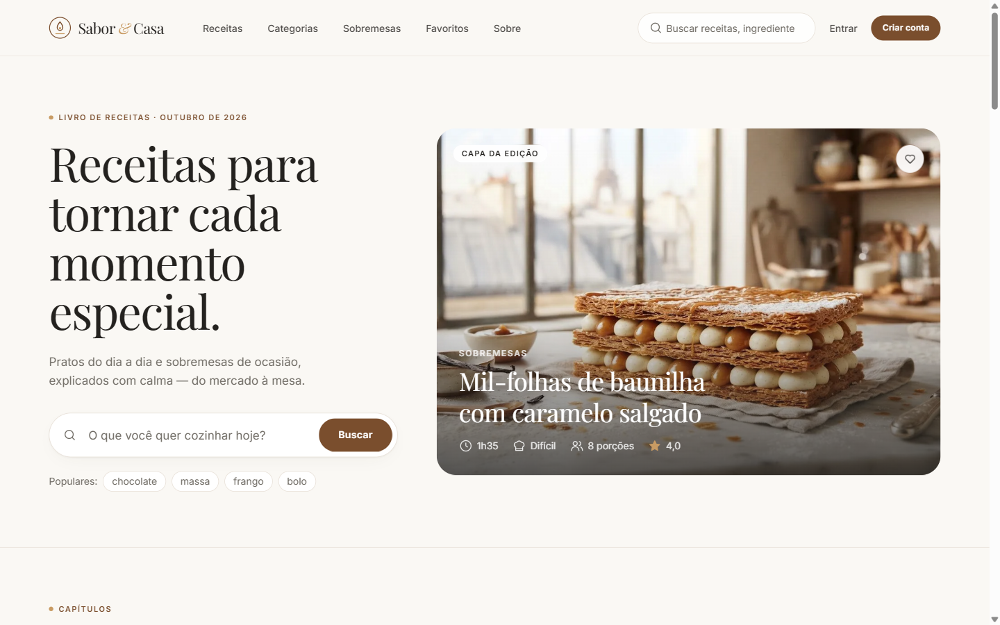
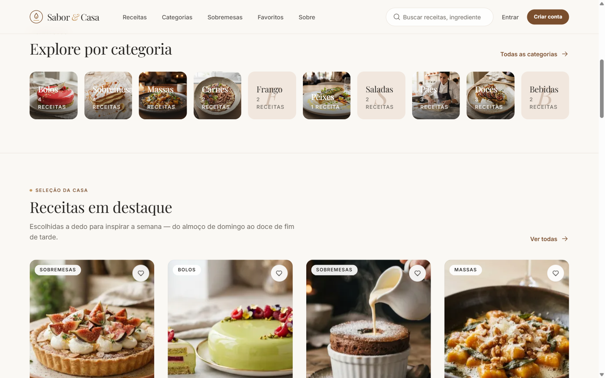
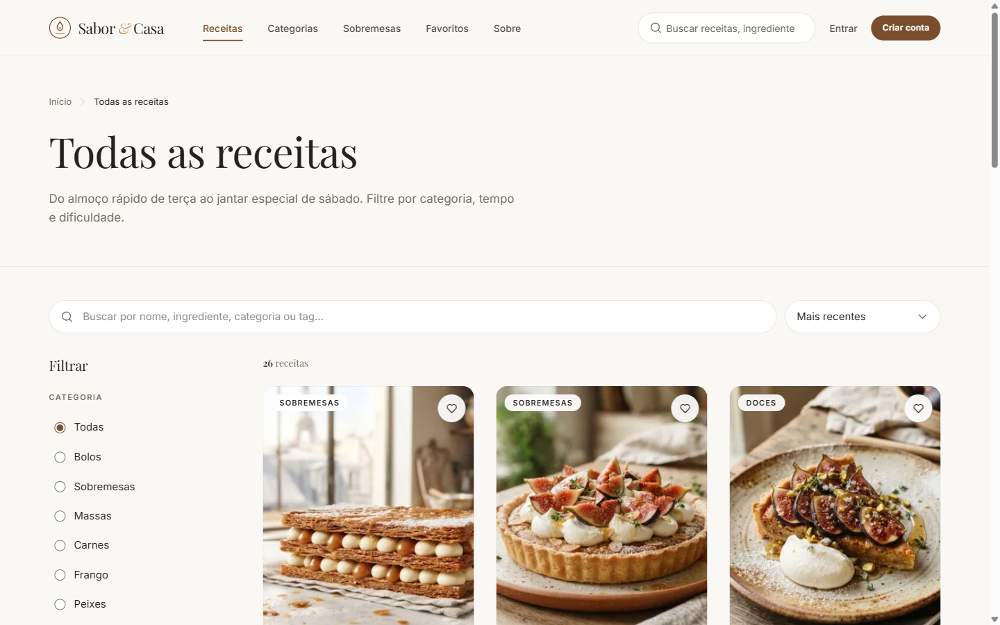
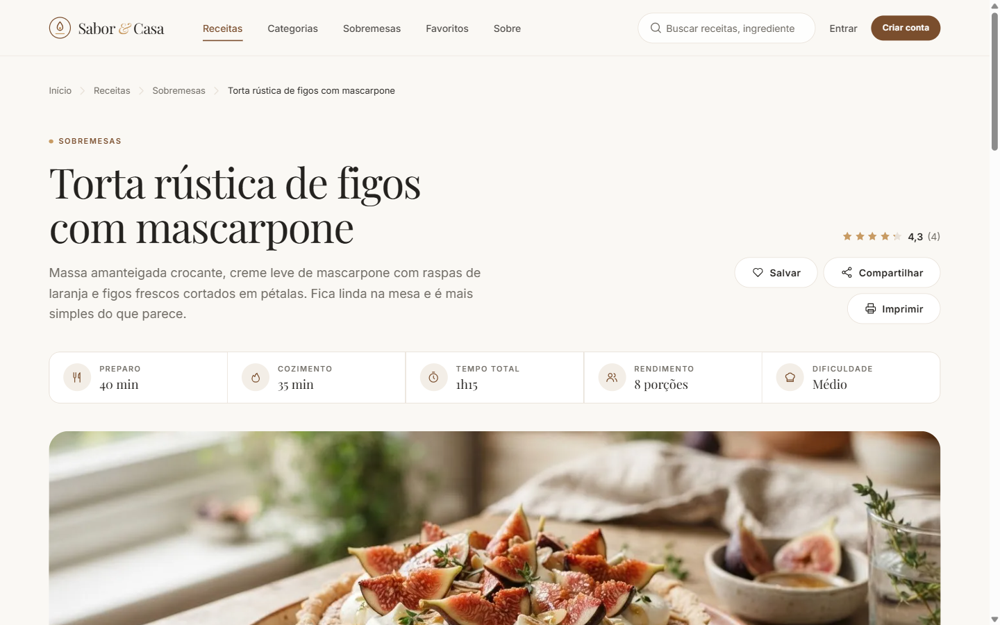
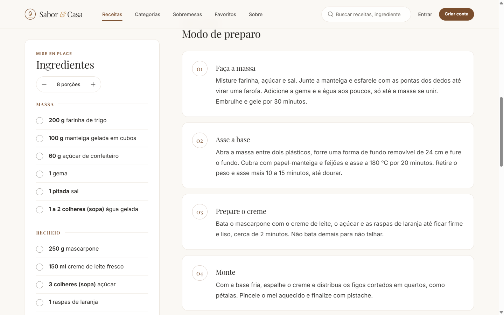
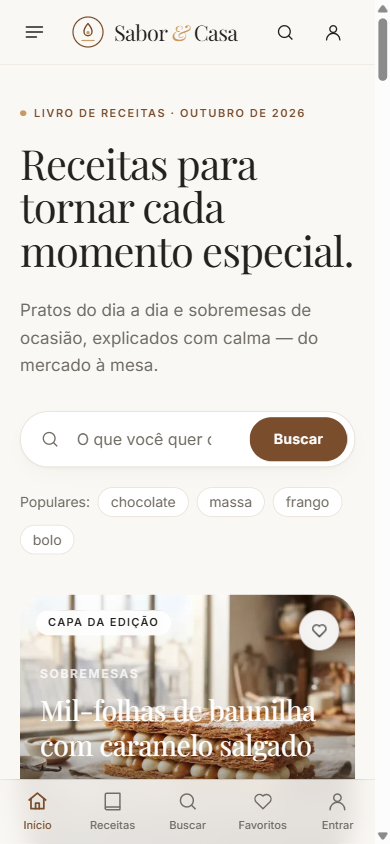
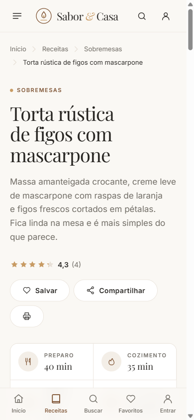
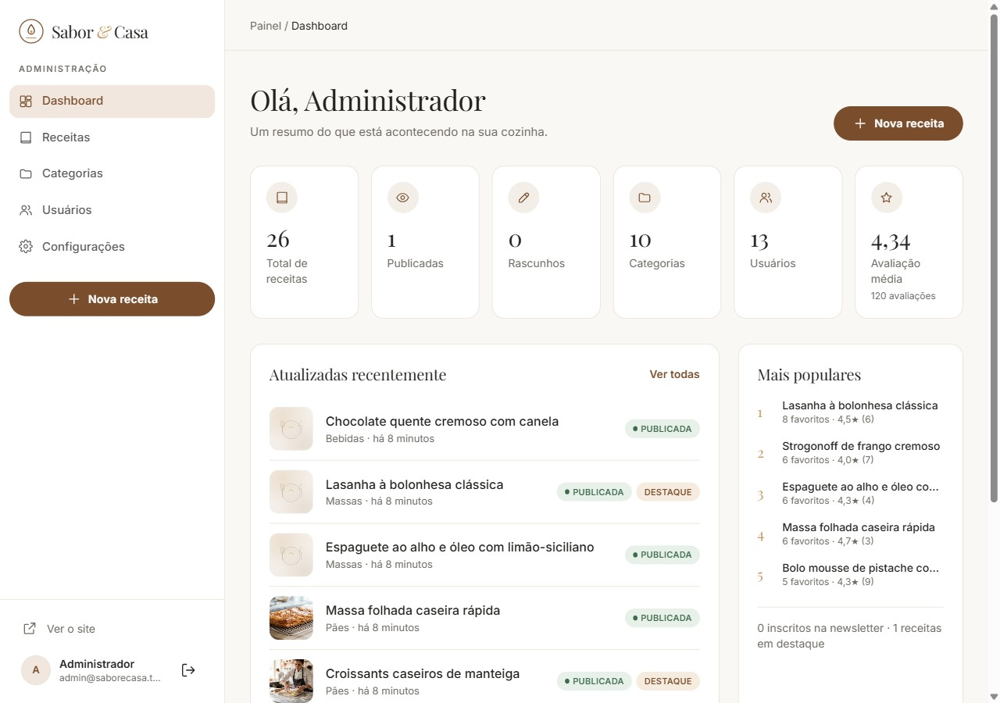

# Aulão de HTML com IA (03/10/2026)

Aula com o professor Eliel Cruz sobre como usar IA pra criar e turbinar sites. As anotações da aula estão no arquivo [`Aulao_imersao_IA_Html`](../Aulao_imersao_IA_Html).

## O projeto: Sabor & Casa 🍰

Na aula a gente fez um site de livro de receitas (comidas e sobremesas) inteiro em **vibe coding**, que é quando você descreve o que quer e a IA escreve o código. Eu fui guiando com prompts e conferindo o resultado no navegador.

O caminho foi esse:

1. **Stitch (IA do Google):** pedi o layout de um site de receitas premium, com versão desktop e mobile, e exportei o design.
2. **ChatGPT:** pedi pra ele sugerir as tecnologias e montar um "prompt master" com o passo a passo completo do projeto.
3. **Claude Code no VS Code:** colei o prompt master junto com o export do Stitch e deixei o Claude construir o site.

Prompt que usei no começo:

> quero um site profissional de livro de receitas de comidas e sobremesas quero que seja premium e duas versoes mobile e desktop

## O que o site tem

- Página inicial com receita de capa, busca, categorias e receitas em destaque
- Lista de receitas com busca e filtros por categoria, tipo, dificuldade e tempo
- Página da receita com tempos, porções ajustáveis (recalcula os ingredientes), checklist de ingredientes e modo de preparo em etapas
- Favoritos, avaliação com estrelas, compartilhar e imprimir
- Cadastro e login de usuário
- Painel administrativo pra cadastrar e editar receitas, categorias e usuários
- Versão mobile com menu inferior

Feito com Laravel 12, Livewire, Tailwind CSS e MySQL.

## Como ficou

**Página inicial**

**Categorias e receitas em destaque**

**Lista de receitas com filtros**

**Página da receita**

**No celular**

  
  

**Painel administrativo**

## O que achei do vibe coding

A facilidade impressiona. Em poucas horas de aula saiu um site com cara de produto pronto, com banco de dados, login e painel admin, coisa que na mão levaria semanas. Pra tirar uma ideia do papel, montar um protótipo ou mostrar um layout pra um cliente, é muito prático.

## ⚠️ Ressalvas de segurança

Esse site é só um **projeto de estudo** e não está publicado. Eu **não fiz nenhuma revisão de segurança** no código que a IA gerou. Antes de colocar algo assim no ar de verdade, teria que:

- revisar o código linha por linha, porque a IA pode deixar falha sem avisar
- trocar senhas e usuários de teste e proteger o arquivo `.env`
- testar login, cadastro e painel admin contra ataques comuns (SQL injection, XSS etc.)
- conferir as bibliotecas instaladas e manter tudo atualizado
- configurar HTTPS e backup do banco

O código do site não está neste repositório, aqui ficam só a apresentação e as imagens.

Resumindo: vibe coding acelera muito, mas não substitui saber o que o código está fazendo. A responsabilidade continua sendo de quem publica.
